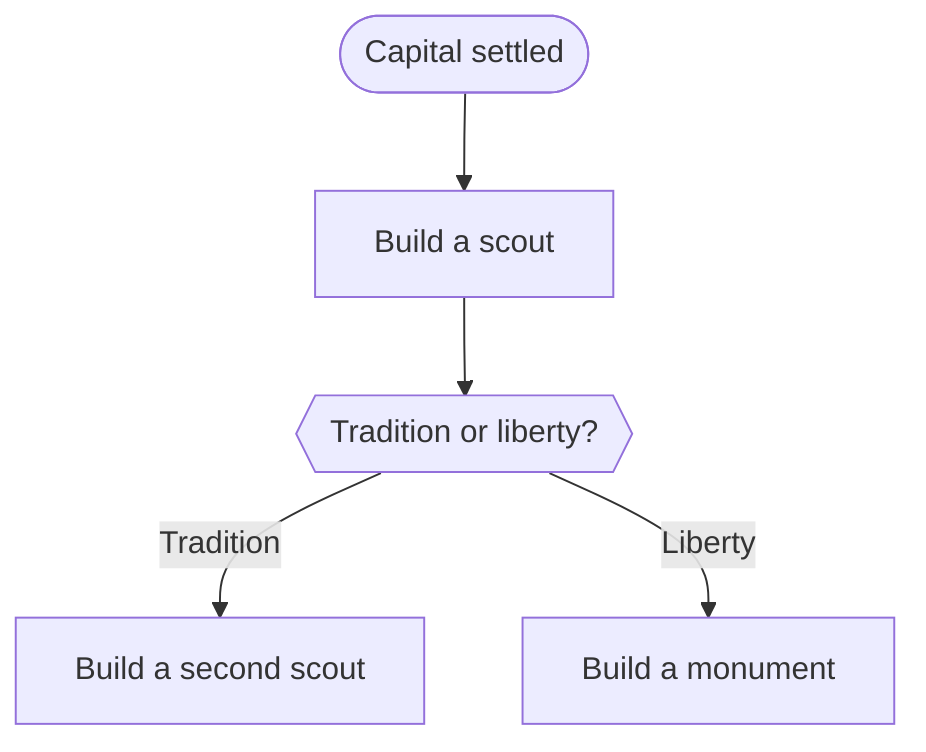

#Guide 

[Video](https://www.youtube.com/watch?v=DgGPJu5sK94)

*Disclaimer: Designed specifically for NQ mod, multiplayer, small, quick, Pangea map. Only recording advice that seems generally applicable.*

#### Production Focus

Note: Every city should have [[Production]] Focus on unconditionally, for the rest of the game. This is because, when a city grows, production worked by the newly birthed citizen will be added to that turn's production generation.

#### Scouting

The *first* thing to think about after settling your capital is scouting. Why?
 1. Identify expansion spots
	 - Why? *Population* is the most important thing in Civ. More cities growing means more population.
	 - Looking for many *unique* luxuries (i.e. not many of the same)
		 - [[Happiness]] is what limits your growth. Luxuries increase your Happiness threshold, therefore they allow you to keep growing.
	 - Looking for high densities of *Additional Resources* (i.e. not Strategic and not Luxury resources)
		 - More yield than normal tiles
	 - Looking for river systems and defensible positions
		 - Again, increased yield, as well as better defense across rivers
 2. Find ruins
 3. Find other civilizations
 4. Find city-states
 5. Make a decision on social policy tree

#### First Productions Flowchart

#### First Research

1. Start **Pottery**. *Why? Early game, Religion should be prioritized*.

#### Coastal Cities

If you *start* coastal, you should probably make as many of your further cities coastal as well. Why? The advantage of being coastal is that ocean trade routes are *way* more efficient than land trade routes.

#### Tradition vs. Liberty

The *default* if you're unsure should be Tradition.

#### Tile Assignment

Growth is **always** your priority.

#### Religion

Religion is very important. It is essentially a long-term *investement* that produces [[Happiness]] and [[Gold]].